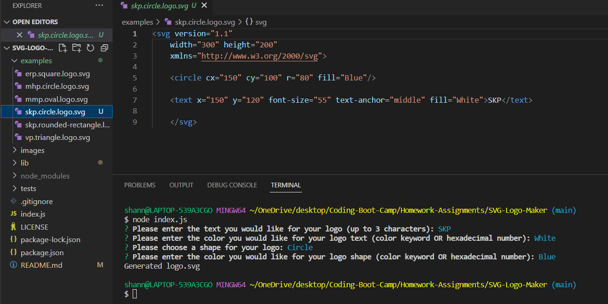
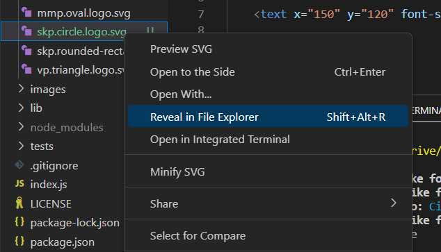
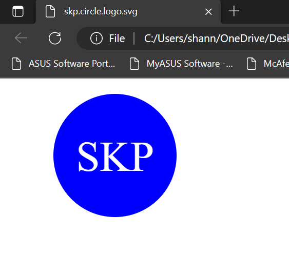
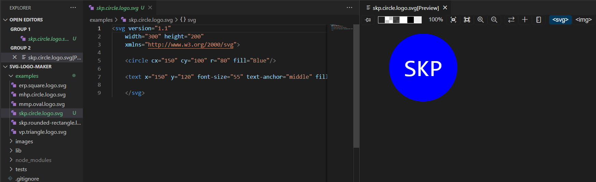

# SVG-Logo-Maker

## Description
This project is a Node.js command-line application that takes in user input to generate a logo and save it as an SVG file. 
This project was created to quickly and efficiently create a simple logo so that developers can display a logo generated for free. 

## Table of Contents
- [Installation](#installation)
- [Usage](#usage)
- [Credits](#credits)
- [License](#license)
- [Badges](#badges)
- [Tests](#tests)
- [Questions](#questions)

## Installation
To use this project, you will need to install inquirer as a dependency. You can do this by using the following command in the terminal:   `$ npm i` 

## Usage
To view a video demonstration of the usage of this application, click [here.](https://drive.google.com/file/d/1W7dOPyhy6bz7DE9HD3TMUF0AlgV_IYB4/view?usp=share_link)  
To run the program, use the following command in the terminal:  `$ node index.js` 
You will be prompted with several inputs to create your logo to your specifications. You will see 'Generated logo.svg' log to the console upon successful creation of your logo file. If unsuccessful, the program will console log the error. You can find your file in the examples folder. You can open it in a browser or preview to view your new logo.  
    
    
    
    

## Credits
Worked with classmate Jen Wariner 
Worked with tutor Jacob Nordan to confirm testing  

## License
MIT License

## Badges

## Tests
To run tests for this application, if you have not already done so, use the following command in the terminal to install jest:   `$ npm i`  Then enter the following command in the terminal:   `$ npm run test`  You will see all test suites and if they pass/fail. 

## Questions
GitHub Profile: [github.com/shannonkprice00](https://github.com/shannonkprice00) 
For further questions, you can reach me at shannonkprice00@gmail.com

